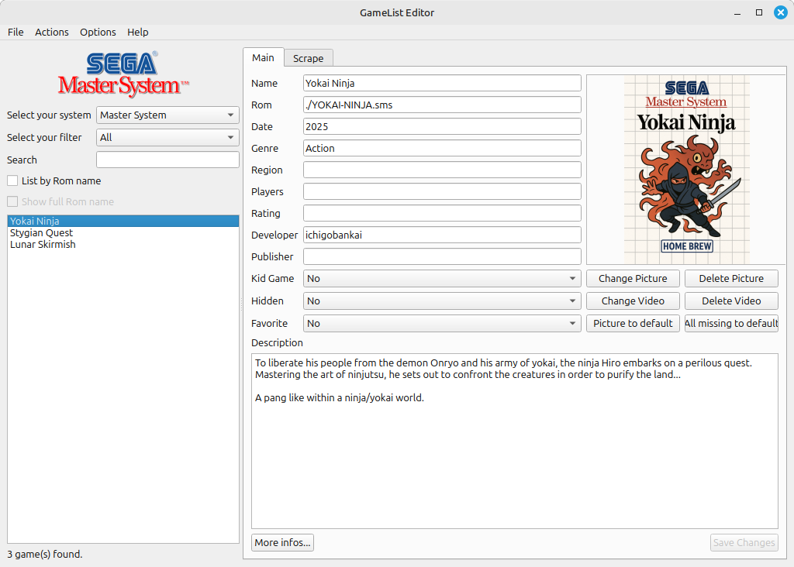

# GameList_Editor_Qt

[](https://github.com/MikeBergmann/GameList_Editor_Qt/actions/workflows/ci.yml)

**Qt6 Port of GameList Editor Delphi**

<a href="./screenshot.png">
  
</a>

(Cover of Yokai Ninja is AI generated)

## The Why

There are a lot of great ROMs for vintage computers/consoles or for their emulators on itch.io.

To manage these ROMs, I use [GameList Editor](https://github.com/andresdelcampo/GameList_Editor) as my 'the' tool for editing/scraping my gamelist.xml.

I want to add some features, but unfortunately, it is written in Delphi (which I don't have a dev toolchain for).

So this repo contains my C++/Qt6 port of the GPLv3 `andresdelcampo/GameList_Editor` (itself a fork of `NeeeeB/GameList_Editor`).

## First Step

- Target: Linux Mint 22.1 (Ubuntu 24.04), Qt6.4, cmake, gcc; also builds on Windows with Qt's MinGW kit (tested with Qt 6.12 / MinGW 13.1)
- Build dependencies (Ubuntu/Mint): `qt6-base-dev qt6-multimedia-dev zlib1g-dev libgtest-dev`
- Windows: install Qt 6 (MinGW kit, with Qt Multimedia, CMake and Ninja) via the Qt installer. zlib comes with the MinGW kit; GoogleTest is downloaded by CMake if not installed.

  ```
  set PATH=C:\Qt\Tools\CMake_64\bin;C:\Qt\Tools\Ninja;C:\Qt\Tools\mingw1310_64\bin;C:\Qt\6.12.0\mingw_64\bin;%PATH%
  cmake -S . -B build -G Ninja -DCMAKE_BUILD_TYPE=Release -DCMAKE_PREFIX_PATH=D:/Qt/6.12.0/mingw_64
  cmake --build build
  build\tests.exe
  windeployqt dist\GameListEditor.exe   # only needed to run it without Qt on PATH (copy the exe to dist\ first, not next to tests.exe)
  ```

- Testing: Google Test
- First drop will contain:
  - No SSH / no Pi remote control
  - English-only UI
  - No theming (default Qt widget style only)

## Current Status

### Implemented

- [x] Loading and systems
- [x] Browsing, searching and filtering the game list
- [x] Edit a game
- [x] Scrape using screenscraper.fr
- [x] Manually adding new games
- [x] Video playback
- [x] Windows build (experimental)

### Stubbed

- [ ] Actions → System: lowercase or uppercase all text, remove region from names, delete orphans, delete duplicates, export the list to a txt file
- [ ] Actions → Game: lowercase or uppercase all text
- [ ] Actions → Selection: add to or remove from Hidden and Favorites, and the Advanced name editor

### Features to add

- [ ] Additional Scrapers (e.g., Launchbox)
- [ ] Specific handling of the xml/media folders, e.g like es-de:

```
├── gamelists/
│   └── nes/
│       └── gamelist.xml
└── downloaded_media/
    └── nes/
        ├── covers/
        ├── screenshots/
        ├── videos/
```

- [ ] Auto-Fix invalid media links
- [ ] Normalize media. E.g., naming, size, etc.
- [ ] Remove unused media

## screenscraper.fr credentials

Scraping needs two separate sets of credentials:

- **Developer credentials** (`devid` / `devpassword`) identify *this application* to the API and grant its request allowance. They are **not** in the repository, and every build that wants to scrape needs its own. Register at [screenscraper.fr](https://www.screenscraper.fr) and ask for developer access, then pass them at configure time:
  
  ```
  cmake -B build -DGLE_SS_DEVID=yourid -DGLE_SS_DEVPWD=yourpassword
  ```
  or export `GLE_SS_DEVID` / `GLE_SS_DEVPWD` before running cmake. Without them the app builds and runs, but scraping reports "no developer credentials". They are baked into the binary, so don't distribute a build made with your own credentials unless you intend to share them.
- **User credentials** (`SSUser` / `SSPwd`) are your personal screenscraper.fr account, entered in the app and stored in your ini.

## Still undecided

Unfortunately, my Mac no longer runs macOS, so there won't be a macOS version until someone volunteers to test.

## AI usage

Yes, I used and will use AI. In my opinion, AI is a great tool for every developer to speed up their work and keep learning, especially if you have no colleagues, as in side projects like this.

Most of the code, the code comments, and all unit tests and test data in this repo were generated by AI. What I do: the design and architecture, the decisions, steering the AI step by step, and reviewing, editing, and testing the result.

In detail, I used AI for:

- Writing new code, based on my design and instructions.
- Generating all the unit tests and test data. Doing that manually is just tedious and nothing I do for fun in a side project.
- Converting resource tables from Delphi to C++/Qt6.
- Helping me analyze the Delphi codebase, because the last time I programmed with Delphi was in 1996.
- Doing code review and refactoring, in the absence of a human reviewer.
- Translating the original French comments to English.
- Checking the grammar and spelling of my texts, because I'm not a native English speaker.

The code comments still describe the port from the Delphi original, sometimes including line numbers. I plan to rewrite them (see [Analysis.md](Analysis.md#later)).

This list is not final, and I will probably find more ways to use AI as I go along. Nevertheless, I will not use AI without steering and reviewing the result. I do this for fun and want to learn and understand.

If you find something that looks wrong or unnecessary, please open an issue. Reviews are welcome.
